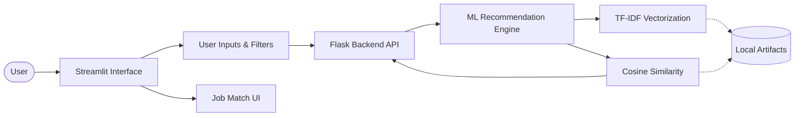
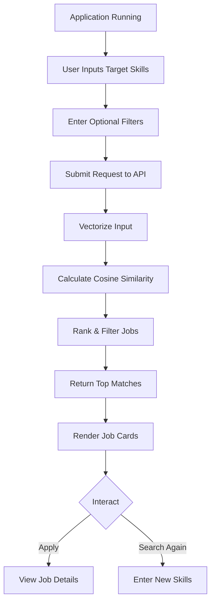

# Smart Job Recommendation Portal
A machine learning-powered job recommendation portal that matches users with their ideal jobs based on their skills, location, and experience level. The application features a sleek, modern UI built with Streamlit and an interactive 3D background using Three.js. The backend is powered by Flask and uses NLP techniques (TF-IDF and Cosine Similarity) to calculate job matches from a curated dataset.

## Features
- **Skill-Based Matching**: Enter your skills (e.g., Python, Machine Learning) to discover relevant job opportunities.
- **Advanced Filtering**: Filter recommendations by preferred location and years of experience.
- **Interactive 3D UI**: A visually engaging frontend built with Streamlit, custom glassmorphism CSS, and interactive Three.js 3D elements for job cards.
- **NLP Powered**: Uses TF-IDF vectorization and cosine similarity to ensure highly accurate job recommendations from the pre-trained models.
- **REST API**: A decoupled backend built with Flask that serves recommendations via a JSON API.

## Installation

### Prerequisites
- Python 3.8+ installed.

### Steps
Clone the repository:
```bash
git clone https://github.com/PixelPawar/Smart-job-recommendation-portal-using-machine-learning.git
cd Smart-job-recommendation-portal-using-machine-learning
```

Install dependencies:
```bash
pip install -r requirements.txt
pip install streamlit requests  # Ensure Streamlit and Requests are installed for the frontend
```

Run the Application:

Terminal 1 (Backend):
```bash
cd backend
python app.py
```

Terminal 2 (Frontend):
```bash
cd frontend
streamlit run app.py
```

## Usage
1. **Start the Application**: Run the backend and frontend as described above. The application will open in your default web browser (typically on `http://localhost:8501`).
2. **Enter Details**: Enter your core **skills** in the search bar.
3. **Filter**: (Optional) Provide your preferred **location** and **years of experience** to narrow down the results.
4. **Get Recommendations**: Click **Get Recommendations** to dynamically fetch and display matching job cards tailored to your profile.

## System Architecture

### Block Diagram
A high-level view of the system components.



### Workflow
The simple process from selection to recommendation.



### Tech Stack
| Component | Technology | Description |
|-----------|------------|-------------|
| Language | Python | Core logic and scripting. |
| GUI | Streamlit | Modern User Interface framework. |
| Backend API | Flask | REST API linking frontend and ML engine. |
| NLP & ML | scikit-learn | TF-IDF Vectorization and Cosine Similarity. |
| UI Styling | Custom CSS & Three.js | Glassmorphism & Interactive 3D elements. |
| Data Processing | Pandas & NumPy | Data cleaning and manipulation. |

## Project Structure
```python
Smart-job-recommendation-portal/
├── frontend/            # Frontend application UI
│   ├── app.py           # Streamlit web application
│   ├── index.html       # Built-in custom HTML / JS integration
│   └── .streamlit/      # UI config settings
├── backend/             # Core backend and API API logic
│   ├── app.py           # Flask REST API
│   ├── recommender.py   # Machine Learning logic (TF-IDF scoring)
│   └── test_load.py     # Diagnostics & testing script
├── ML/Models/           # Generated and exported trained model artifacts
├── data/                # Job listing raw/processed data sets
├── notebook/            # Exploratory Data Analysis & script logs
├── requirements.txt     # Global Python Dependencies
└── README.md            # Entry point documentation file
```
